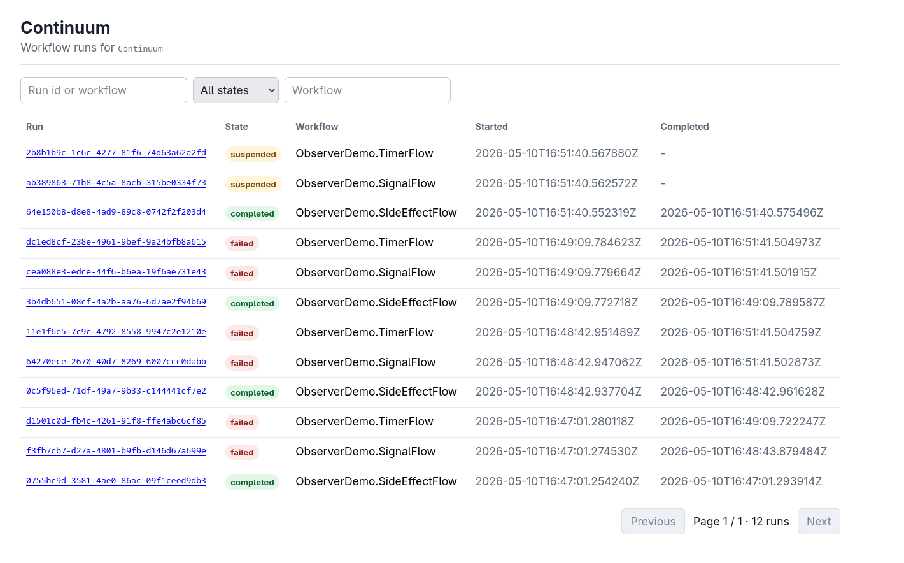

# Continuum

[English](./README.md) | **简体中文**

[](https://github.com/Yyeger/Continuum/actions/workflows/ci.yml)
[](https://hex.pm/packages/continuum)
[](https://hexdocs.pm/continuum)
[](./LICENSE)

**Continuum 是面向 Elixir 的持久化执行引擎。** 把多步业务流程当作普通的直线式
Elixir 代码来写；即便发生失败、重启或节点宕机，工作流也会通过同一套纯编排代码
重放其事件历史，从而以完全一致的状态，从上次中断的位置*精确恢复执行*。

它是 OTP 原生、基于 Postgres 的 —— 没有独立的集群服务，没有付费 SaaS 依赖，
也没有多语言 SDK。Continuum 直接驻留在你的应用监督树中，并使用你已经在运行的
那一个数据库。

## 为什么选择 Continuum

Continuum 之于持久化执行，正如 Phoenix 之于 Web、Oban 之于任务队列：对于
Elixir 优先的团队而言，它是 *"我该如何运行一个能在崩溃中存活的多步业务流程？"*
这一问题的显而易见的答案。

- **直线式代码。** 用普通的 Elixir 控制流来表达编排 —— `case`、`with`、推导式。
  副作用通过 `activity/2`、`await signal` 与 `timer` 进行；其余一切皆为纯函数。
- **确定性重放。** 每次唤醒时，运行都会从头重新执行。结构化的游标身份意味着重放
  与原始执行之间的任何偏差，都会以醒目的 `Continuum.ReplayDriftError` 暴露出来，
  而绝不会发生静默损坏。
- **单一依赖。** Postgres 是你唯一需要运维的组件 —— 它同时承担日志、租约存储、
  定时器轮以及信号总线（`LISTEN`/`NOTIFY`）。
- **它就是 OTP。** Continuum 是一棵你加入自己应用的监督树。崩溃恢复、租约与背压
  都构建在进程之上，而非某个外部协调器。

**有意排除在外的范围：** 多语言 SDK、跨语言活动、独立的集群服务，以及
Kubernetes operator。

## 快速开始

```elixir
defmodule MyApp.OrderFlow do
  use Continuum.Workflow, version: 1

  def run(%{order_id: id, items: items}) do
    {:ok, validated} = activity Validation.check(items)

    {:ok, charge} =
      activity Payments.charge(id, validated.total),
        retry: [max_attempts: 5, backoff: :exponential],
        compensate: {Payments, :refund, [id]}

    case await signal(:fraud_review, timeout: hours(24)) do
      :approved -> activity Fulfillment.ship(id)
      :rejected ->
        compensate(charge)
        {:error, :fraud_rejected}

      :timeout  -> activity Fulfillment.ship(id)
    end
  end
end
```

```elixir
{:ok, run_id} = Continuum.start(MyApp.OrderFlow, %{order_id: "o1", items: [...]})

# 可在任何位置发送 —— 持久化邮箱，能够在重启之间存活
:ok = Continuum.signal(run_id, :fraud_review, :approved)

# 通过 PubSub 阻塞等待，并以轮询作为兜底
{:ok, %{state: :completed, result: result}} = Continuum.await(run_id, 30_000)
```

## 安装

将 Continuum 与一个 Postgres 驱动加入依赖：

```elixir
def deps do
  [
    {:continuum, "~> 0.5"},
    {:postgrex, "~> 0.19"}
  ]
end
```

将 Continuum 指向你的 Repo：

```elixir
# config/config.exs
config :continuum, repo: MyApp.Repo, journal: Continuum.Runtime.Journal.Postgres
```

生成并执行迁移：

```bash
mix continuum.gen.migration --repo MyApp.Repo
mix ecto.migrate
```

把 Continuum 的运行时子进程加入到你的监督树中，**位置必须在你的 Repo 之后**：

```elixir
def start(_type, _args) do
  children =
    [
      MyApp.Repo,
      {Phoenix.PubSub, name: MyApp.PubSub}
    ] ++
      Continuum.children() ++
      [MyAppWeb.Endpoint]

  Supervisor.start_link(children, strategy: :one_for_one, name: MyApp.Supervisor)
end
```

## 特性

### 确定性源于构造

- 工作流代码在构造上即为纯函数，每次唤醒时都会自上而下重新执行；只有副作用才会
  产生对外可见的工作。
- **编译期 AST 扫描** 会拒绝非确定性调用（`DateTime.utc_now`、`:rand.*`、
  `:ets.*`、`Process.send`、`Kernel.apply`……），并附带修复建议。辅助模块可通过
  `use Continuum.Pure` 或 `config :continuum, trusted_modules: [...]` 白名单主动
  加入受信集合。
- 确定性原语 —— `Continuum.now/0`、`today/0`、`uuid4/0`、`random/0`，以及
  `side_effect/1` 这一逃生通道 —— 会在编译期捕获稳定的游标身份。

### 持久化执行

- **Postgres 日志** 在每次写入时进行租约 + 隔离令牌 CAS 校验。被夺走的租约会
  导致写入失败并终止陈旧的引擎进程 —— 它绝不会损坏历史。
- **活动执行**：默认使用内置工作进程池 —— 采用 `FOR UPDATE SKIP LOCKED` 抢占任务、
  指数退避重试、按任务隔离，并将结果与任务状态在同一事务中原子提交；重试/超时
  策略通过 `use Continuum.Activity` 配置。也可选用 `Continuum.Oban` 执行器，让已经
  运行 Oban 的团队复用其队列。无论采用哪种方式，Continuum 都在自有的持久化任务表中
  保留重试/超时策略、幂等性与隔离令牌提交。
- **持久化定时器与信号**，基于 `pg_notify`/`LISTEN`。
  `await signal(name, timeout: ms)` 以确定性的方式解决信号/超时之间的竞态。
- **崩溃存活能力。** 在工作流执行中途强杀引擎进程，调度器会重新租约该运行，
  重放会基于已写入日志的历史完成剩余执行。启动时恢复会救回孤立的运行、任务及
  到期定时器，且不会窃取仍在运行的远端租约。
- **跨运行幂等性**，以 `(activity_module, idempotency_key)` 为键，使活动在多个
  运行之间近乎恰好一次（exactly-once-ish）。

### 工作流组合

- **Saga / 补偿** —— 为活动附加 `compensate:`，然后使用 `compensate/1` 或
  `compensate_all/0`，以确定性的 LIFO（或并行）顺序回滚已完成的工作。
- **父子工作流** —— `await child Mod.run(input)`、`start_child/3` 与
  `await_child/1`，用于持久化的 fan-out/fan-in。
- **`continue_as_new/1`** —— 结束当前运行并以全新历史启动后继运行，适用于长时间
  运行的循环。
- **工作流版本管理** —— 带日志记录的 `Continuum.patched?/1` 标记，用于安全的原地
  改动；以及内容寻址的 `(workflow, version_hash)` 分发，它会将缺失的代码标记为
  `:stuck_unknown_version`，而不是用已变更的逻辑重放。

### 运维与可观测性

- **`Continuum.Observer`** —— 可选的 Phoenix LiveView，提供运行列表、按运行展示
  已解码事件时间线的详情页，以及取消运行与注入信号的运维操作。
- **`Continuum.OpenTelemetry`** —— 可选启用的桥接，将 Continuum 的遥测转换为
  `run_attempt`/`activity_attempt` span，并通过持久化的 W3C `traceparent`
  反向关联。
- 在 `[:continuum, …]` 前缀下提供 **24+ 个有文档记载的遥测事件**。
- **运维工具** —— 按月分区的事件表、按需启用的历史快照、只读的
  `mix continuum.audit`，以及默认 dry-run（仅预览）的清理任务。

### 多租户与集群

- **命名多实例运行时** —— 通过 `Continuum.children(name:, repo:)` 启动，每个实例
  绑定到各自的 Ecto Repo。
- **命名空间** —— 用于列表/查询的软租户边界；单个运行的操作仍以全局 `run_id`
  为键。
- **搜索属性与结构化查询** —— `attributes:` / `Continuum.set_attributes/3`，
  以及 `Continuum.query/1,2`。
- **集群感知的唤醒路由** —— 基于 `:pg` 实现跨节点唤醒。Postgres 租约与隔离令牌
  仍是写入的唯一权威。

### 测试

`Continuum.Test` 提供用于快速单元测试的内存日志、面向集成测试的 Postgres 辅助
函数、信号/定时器注入、黄金历史重放，以及一个可选启用的"偏执"重放模式，用于
捕获偏差。

## 父子工作流示例

```elixir
defmodule MyApp.BatchFlow do
  use Continuum.Workflow, version: 1

  def run(%{order_ids: ids}) do
    ids
    |> Enum.map(fn id ->
      start_child MyApp.OrderFlow, %{order_id: id}, id: id
    end)
    |> Enum.map(&await_child/1)
  end
end
```

## Observer

可选的 `Continuum.Observer` LiveView 会列出所有运行、按运行渲染日志事件
时间线，并提供取消运行、发送信号等运维操作。它由宿主 Phoenix 路由挂载，
本身不附带任何鉴权 —— 请将其包裹在你已有的管理员管线中。



```elixir
import Continuum.Observer.Router

scope "/admin" do
  pipe_through [:browser, :authenticate_admin]

  continuum_observer "/continuum", instance: :myapp_continuum
end
```

要在本地预览界面，仓库内自带了一个独立的演示脚本：

```bash
docker compose up -d
MIX_ENV=test iex -S mix run dev/observer_demo.exs
# 然后在浏览器打开 http://localhost:4000/continuum
```

该演示会预先创建三个处于不同状态的运行，并打印 iex 帮助命令，便于继续创建
新的运行、发送信号或取消运行。生产环境的挂载方式见
[`guides/observer.md`](./guides/observer.md)。

## 文档

完整文档发布于 [HexDocs](https://hexdocs.pm/continuum)。指南覆盖了全部能力面：

- *你的第一个工作流*
- *活动、重试与幂等性* · *Oban 活动执行器*
- *确定性规则与重放漂移*
- *Saga 与补偿* · *子工作流* · *长时间运行的工作流*
- *为工作流打补丁* · *工作流版本管理*
- *多实例 Continuum* · *集群部署* · *命名空间*
- *搜索属性与结构化查询*
- *运维* · *审计* · *Observer* · *可观测性（OpenTelemetry）* · *快照*

[`examples/continuum_example_orders`](./examples/continuum_example_orders)
是一个 Phoenix 示例应用，演示了 活动 → 信号/超时 → 补偿、父子批处理、
`continue_as_new`、按工作流的快照、命名空间、Observer 以及 OpenTelemetry。

需要升级？参见[迁移指南](./guides/migrations/)。

## 状态

Continuum 当前为 **v0.5.1（1.0 之前）**。持久化引擎、确定性强制、工作流组合、
可观测性及集群能力面均已实现并有测试覆盖，包括崩溃恢复、租约隔离竞态以及基于
属性的重放测试。1.0 之前 API 仍可能调整 —— 生产环境请固定到具体的 `0.x`
版本。发布历史见 [`CHANGELOG.md`](./CHANGELOG.md)。

## 开发

仓库根目录的 `docker-compose.yml` 会为本地开发与测试启动 Postgres。

```bash
mix deps.get
docker compose up -d                  # Postgres 监听 localhost:5432
mix compile --warnings-as-errors
mix test                              # 单元 + 集成测试套件
mix test.cluster                      # 真实的 :peer 集群测试（需单独运行）
mix format
```

## 许可证

版权所有 2026 The Continuum Authors。(yyeger)

依据 [Apache License, Version 2.0](./LICENSE) 授权。
